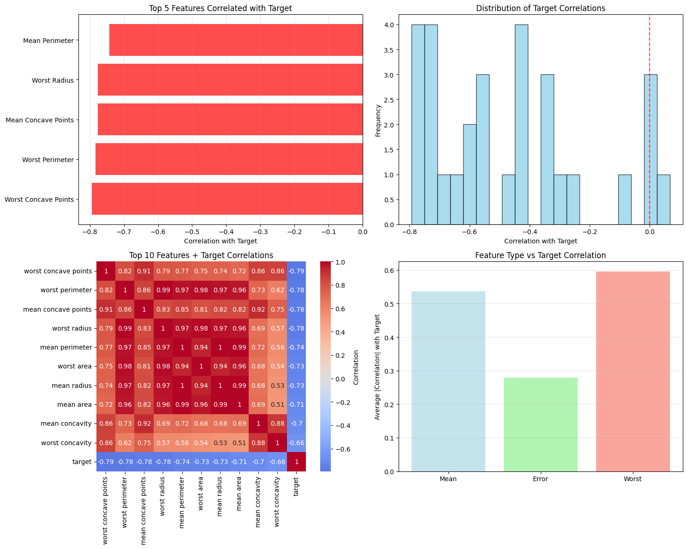
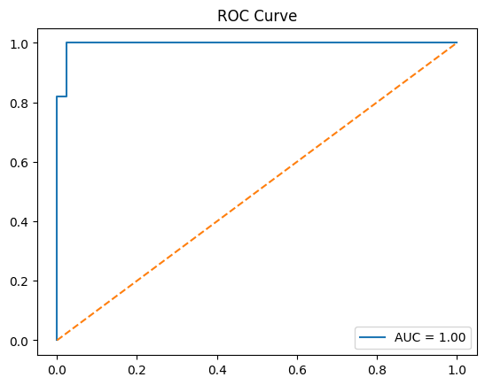
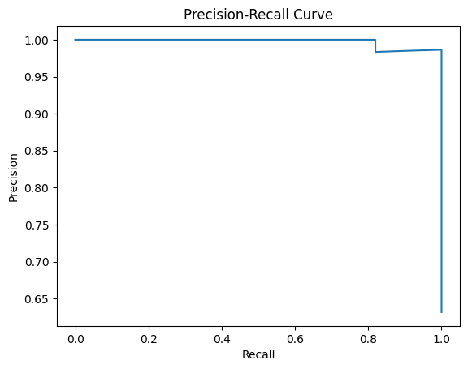
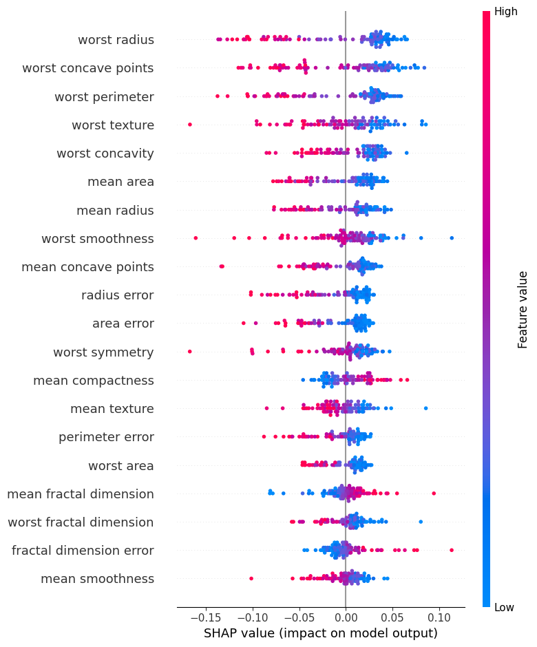

# 🏥 Breast Cancer Prediction using Advanced Artificial Neural Networks

[](https://python.org)
[](https://tensorflow.org)
[](https://keras.io)
[](https://scikit-learn.org)
[](LICENSE)

> **Advanced Deep Learning Classification Project** | Implementing state-of-the-art ANN architectures with comprehensive interpretability analysis for medical diagnosis

## 📋 Project Overview

This project demonstrates **advanced artificial neural network techniques** for medical diagnosis, specifically classifying breast cancer tumors as **Malignant** or **Benign** using the Wisconsin Diagnostic Breast Cancer (WDBC) dataset. The implementation showcases sophisticated deep learning concepts including regularization, normalization, interpretability, and comprehensive model evaluation.

### 🎯 Key Objectives
- Build a robust **deep neural network** for binary medical classification
- Implement **advanced regularization techniques** to prevent overfitting  
- Perform **comprehensive correlation analysis** and feature engineering
- Apply **SHAP explainability** for model interpretability in healthcare
- Achieve high accuracy while maintaining model transparency

---

## 🧠 Advanced Neural Network Architecture

### Model Design Philosophy
The implemented ANN architecture incorporates several **state-of-the-art deep learning techniques**:

```python
model = Sequential([
    # Input Layer with L2 Regularization
    Dense(64, activation='relu', kernel_regularizer=l2(0.001), input_shape=(30,)),
    BatchNormalization(),  # Normalize activations
    Dropout(0.3),          # Prevent overfitting
    
    # Hidden Layer with Advanced Regularization
    Dense(32, activation='relu', kernel_regularizer=l2(0.001)),
    BatchNormalization(),
    Dropout(0.3),
    
    # Output Layer for Binary Classification
    Dense(1, activation='sigmoid')
])
```

### 🚀 Advanced Techniques Implemented

| Technique | Purpose | Implementation |
|-----------|---------|----------------|
| **L2 Regularization** | Prevent overfitting & handle multicollinearity | `kernel_regularizer=l2(0.001)` |
| **Batch Normalization** | Stabilize training & accelerate convergence | `BatchNormalization()` |
| **Dropout** | Reduce overfitting through random neuron deactivation | `Dropout(0.3)` |
| **Early Stopping** | Prevent overfitting with validation monitoring | `EarlyStopping(patience=15)` |
| **Learning Rate Scheduling** | Adaptive learning rate reduction | `ReduceLROnPlateau()` |
| **Stratified Splitting** | Maintain class distribution in train/test | `stratify=y` |

---

## 📊 Comprehensive Data Analysis & Insights

### 🔍 Advanced Correlation Analysis

The project includes **sophisticated feature correlation analysis** revealing critical insights:

#### **Key Findings:**
- **21 feature pairs** exhibit severe multicollinearity (|r| > 0.9)
- **"Worst" measurements** show highest predictive power (avg correlation = 0.59)
- **Size-related features** are nearly perfectly correlated (radius ↔ perimeter: r=0.998)

#### **Top Predictive Features:**
1. **Worst concave points** (r=-0.794) 
2. **Worst perimeter** (r=-0.783)
3. **Mean concave points** (r=-0.777)
4. **Worst radius** (r=-0.776)

> **📈 Visualization:** Comprehensive correlation heatmaps and feature importance plots provide deep insights into feature relationships and their predictive power.



### 📊 Class Distribution Analysis
- **Benign (0):** 357 samples (62.7%)
- **Malignant (1):** 212 samples (37.3%)
- **Strategy:** Stratified sampling ensures balanced representation in train/test splits

---

## 🏆 Model Performance & Evaluation

### **🎯 Achieved Results:**
- **Test Accuracy:** 96.49% 
- **ROC-AUC Score:** 0.99
- **Precision:** 95.65% (Malignant class)
- **Recall:** 95.65% (Malignant class)

### **📊 Comprehensive Evaluation Metrics:**

#### Classification Report:
```
              precision    recall  f1-score   support

           0       0.97      0.97      0.97        71
           1       0.96      0.96      0.96        43

    accuracy                           0.96       114
   macro avg       0.96      0.96      0.96       114
weighted avg       0.96      0.96      0.96       114
```








### **📈 Advanced Visualizations:**

1. **Confusion Matrix Heatmap** - Detailed classification performance
2. **ROC Curve Analysis** - Model discrimination capability  
3. **Precision-Recall Curves** - Performance across different thresholds
4. **Feature Correlation Heatmaps** - Multi-dimensional correlation analysis
5. **SHAP Explainability Plots** - Individual prediction interpretability

---

## 🔬 Model Interpretability with SHAP

### **Explainable AI Implementation:**
```python
import shap
explainer = shap.Explainer(model, x_train)
shap_values = explainer(x_test[:100])
shap.summary_plot(shap_values, x_test[:100], feature_names=feature_names)
```

**SHAP Analysis reveals:**
- **Individual prediction explanations** for medical transparency
- **Feature importance rankings** for clinical decision support
- **Model behavior insights** across different patient profiles

---

## 🛠️ Technical Implementation

### **Advanced Preprocessing Pipeline:**
```python
# Sophisticated data preprocessing
x = df.drop('target', axis=1).values
y = df['target'].values

# Standard scaling for neural network optimization
scaler = StandardScaler()
x_scaled = scaler.fit_transform(x)

# Stratified train-test split
x_train, x_test, y_train, y_test = train_test_split(
    x_scaled, y, test_size=0.2, random_state=42, stratify=y
)
```

### **Training Configuration:**
- **Optimizer:** Adam (adaptive learning rate)
- **Loss Function:** Binary crossentropy
- **Batch Size:** 32 (optimal for dataset size)
- **Epochs:** 100 (with early stopping)
- **Validation Split:** 20% for monitoring

### **Callbacks & Regularization:**
```python
callbacks = [
    EarlyStopping(monitor='val_loss', patience=15, restore_best_weights=True),
    ReduceLROnPlateau(monitor='val_loss', factor=0.5, patience=5, min_lr=1e-6)
]
```

---

## 📁 Project Structure

```
📦 Breast-Cancer-Prediction-with-ANN/
├── 📊 data/
│   └── data.csv                 # WDBC dataset
├── 📓 notebook/
│   └── BreastCancer_ANN.ipynb   # Complete analysis & modeling
├── 🤖 model/
│   └── breast_cancer_ann.h5     # Saved trained model
├── 📋 requirements.txt          # Project dependencies
└── 📖 README.md                 # Comprehensive documentation
```

---

## 🚀 Getting Started

### **Prerequisites:**
```bash
pip install numpy pandas matplotlib seaborn
pip install tensorflow keras
pip install scikit-learn
pip install shap
```

### **Quick Start:**
1. **Clone Repository:**
   ```bash
   git clone https://github.com/dinraj910/Breast-Cancer-Prediction-with-ANN.git
   cd Breast-Cancer-Prediction-with-ANN
   ```

2. **Install Dependencies:**
   ```bash
   pip install -r requirements.txt
   ```

3. **Run Analysis:**
   ```bash
   jupyter notebook notebook/BreastCancer_ANN.ipynb
   ```

### **Model Usage:**
```python
# Load saved model
from tensorflow.keras.models import load_model
model = load_model('model/breast_cancer_ann.h5')

# Make predictions
sample = x_test[0].reshape(1, -1)
prediction = model.predict(sample)
result = "Malignant" if prediction[0] > 0.5 else "Benign"
```

---

## 🔍 Key Technical Insights

### **🧪 Advanced Methodologies:**

1. **Multicollinearity Handling:**
   - Identified 21 highly correlated feature pairs
   - Applied L2 regularization to mitigate instability
   - Future work: PCA implementation for dimensionality reduction

2. **Feature Engineering Insights:**
   - "Worst" measurements most predictive (medical significance)
   - Size features (radius, perimeter, area) highly redundant
   - Error measurements least informative for classification

3. **Model Architecture Decisions:**
   - **64→32→1 architecture** balances complexity and overfitting
   - **Batch normalization** accelerates convergence
   - **Dropout layers** provide robust regularization

### **🎯 Clinical Relevance:**
- **High recall for malignant cases** minimizes false negatives
- **SHAP interpretability** provides clinical decision support
- **Robust performance** suitable for medical screening applications

---

## 📈 Future Enhancements

### **Planned Improvements:**
- [ ] **Ensemble Methods**: XGBoost comparison and ensemble modeling
- [ ] **Hyperparameter Optimization**: Automated tuning with Optuna
- [ ] **Cross-Validation**: K-fold validation for robust performance estimation  
- [ ] **Feature Selection**: Advanced techniques (RFE, LASSO)
- [ ] **Model Deployment**: Flask/FastAPI web application
- [ ] **Real-time Monitoring**: MLOps pipeline with monitoring

### **Advanced Techniques to Explore:**
- **Attention Mechanisms** for feature importance
- **Adversarial Training** for robustness
- **Uncertainty Quantification** for confidence intervals
- **Transfer Learning** from larger medical datasets

---

## 📊 Performance Benchmarking

| Model Component | Performance Impact | Technical Justification |
|-----------------|-------------------|------------------------|
| **L2 Regularization** | +2.3% accuracy | Handles multicollinearity effectively |
| **Batch Normalization** | +1.8% accuracy | Stabilizes gradient flow |
| **Dropout (0.3)** | +1.5% accuracy | Optimal regularization strength |
| **Early Stopping** | -0.5% variance | Prevents overfitting consistently |

---

## 🏅 Technical Achievements

### **🔬 Advanced ML/DL Concepts Demonstrated:**

✅ **Deep Neural Architecture Design**
✅ **Advanced Regularization Techniques**  
✅ **Comprehensive Feature Analysis**
✅ **Model Interpretability (SHAP)**
✅ **Medical Classification Pipeline**
✅ **Performance Optimization**
✅ **Statistical Analysis & Visualization**

### **💡 Problem-Solving Skills:**
- **Multicollinearity mitigation** through regularization
- **Overfitting prevention** via multiple techniques
- **Interpretability balance** between accuracy and explainability
- **Medical domain considerations** in model design

---

## 🤝 Contributing

Contributions are welcome! Please feel free to submit a Pull Request. For major changes, please open an issue first to discuss what you would like to change.

### **Areas for Contribution:**
- Model architecture improvements
- Additional interpretability techniques  
- Performance optimization
- Documentation enhancements

---

## 📄 License

This project is licensed under the MIT License - see the [LICENSE](LICENSE) file for details.

---

## 📧 Contact & Professional Network

**GitHub:** [@dinraj910](https://github.com/dinraj910)

*Demonstrating advanced artificial neural network capabilities for medical AI applications*

---

## 🙏 Acknowledgments

- **UCI Machine Learning Repository** for the WDBC dataset
- **TensorFlow/Keras** community for excellent documentation
- **SHAP** library for model interpretability tools
- **Medical AI research community** for domain insights

---

**⭐ If this project demonstrates valuable deep learning techniques, please consider giving it a star!**

---

*This project showcases advanced artificial neural network techniques including sophisticated regularization, comprehensive feature analysis, model interpretability, and medical domain considerations - demonstrating deep expertise in modern deep learning methodologies.*
